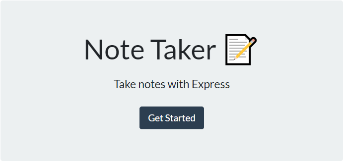
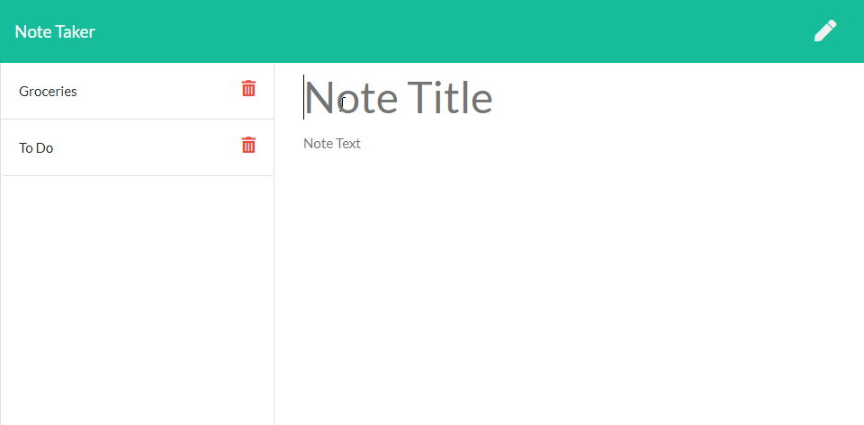
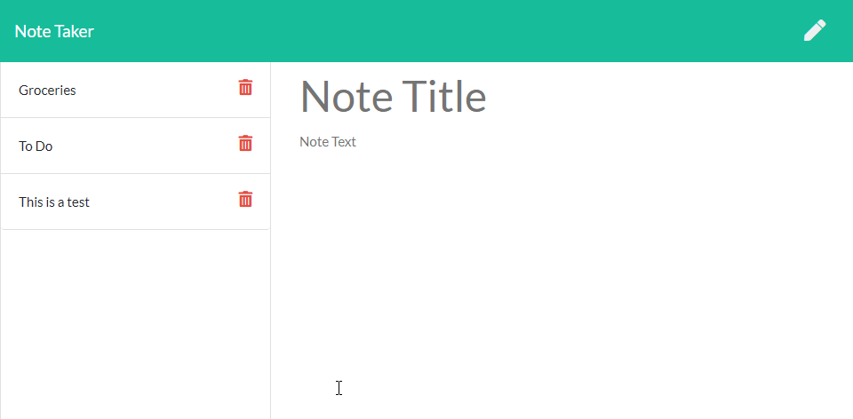
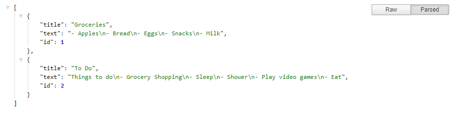

# Duly Noted  [](https://opensource.org/licenses/MIT) 
##### This readme has been procedurally generated 

-----------------------
## Table of Contents
1. [Description](#description)
2. [Deployed link](#deployed-link)
3. [Installation](#installation)
4. [Usage](#usage)
5. [Code Snippets](#code-snippets)
5. [Licenses](#licenses)
6. [Contributing](#contributing)
7. [Tests](#tests)
8. [Questions](#questions)
9. [Acknowledgements](#acknowledgements)

-----------------------
## Description
This is a note taking application built in Javascript, using Express JS.

-----------------------
## Deployed link
https://salty-bayou-60037.herokuapp.com/

-----------------------
## Installation
Download or fork repo and run the following command to install dependencies

```
npm install
```

-----------------------
## Usage
To use this repo you will need a working knowledge of Javascript and Node. 

To run this tool locally use the following command.

```
node server.js
```

Upon launching the app either through visiting the deployed link on Heroku or running the server locally and navigating to localhost:3000, the user will be presented with the following main page and can click on the Get Started button to begin taking notes


On the Notes page the user can enter in a title and text to save. The save button doesn not appear til a title and a text are present.

 On the left side, the user can view a list of saved notes(there are some placeholders to start) and can choose to delete any note by clicking on its corresponding delete button(trash can icon).



The api JSON looks as such

-----------------------
## Code snippets
When initially working on this project, I ran into an issue where the html files would not recognize their associated local css and js files. Trhough Google and reviewing the Express JS docs, I came across the `express.static` function of Express. By adding the following line of code, I could pass along my static files in the server making them available to my html file routes.

```
app.use(express.static(path.join(__dirname, 'public')));
```


Additionally, as a note taking application, I needed to be able to delete notes. The most logical solution was to give each note an ID. I debated between using the uUID npm module and using the array index. Ultimately I decided on array index, though it came with its own problems. For instance, deleting a note in the middle of the array would break any for loops that went over the array. My solution was to update the ID of each note when creating and deleting notes as seen in the code for my delete function. I splice the note I want to remove then update the IDs in a for loop.

```
app.delete("/api/notes/:id", function (req, res) {
	var chosenNote = req.params.id;
	notes.splice(chosenNote - 1, 1);

	for(var i = 0; i < notes.length; i++) {
		notes[i].id = i + 1;
	}
	res.send();
})
```

-----------------------
## Licenses
This project uses a [MIT License](https://opensource.org/licenses/MIT). 

-----------------------
## Contributing
If you would like to contribute, you will need to know Javascript, Node, and Express.js.

This application was built with the following

- Node.JS
- Express.JS
- Javascript 
- JSON 
- HTML/CSS
- Bootstrap
- Git/GitHub
- Heroku

-----------------------
## Tests
To run tests run the following command:
```
NA
```

-----------------------
## Questions
Created by Muhammad A Khalid

If you have any questions you can reach me at the following email: [akhalid.code@gmail.com](mailto:akhalid.code@gmail.com)

Follow my other work at GitHub: https://github.com/akhalid88/

-----------------------
## Acknowledgements

- Jerome Chenette
- Manuel Nunes
- Mahisha Manikandan
- UC Berkeley Coding Bootcamp